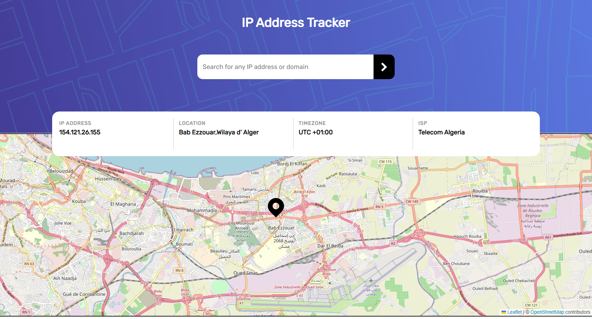
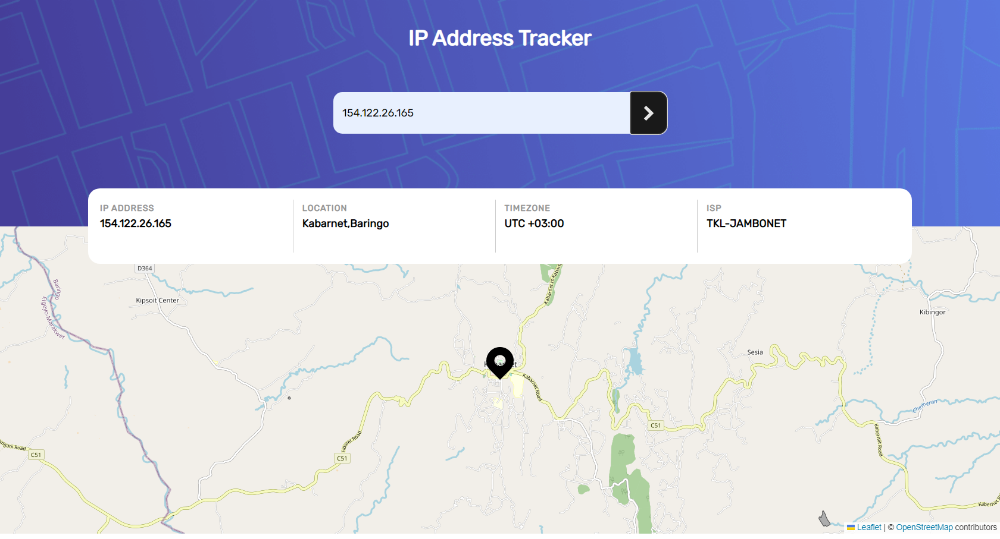
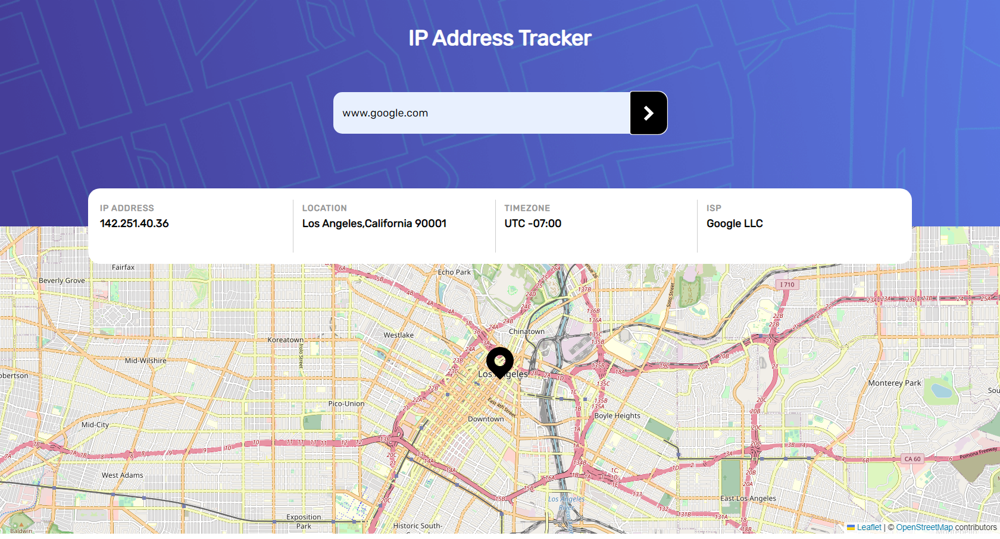
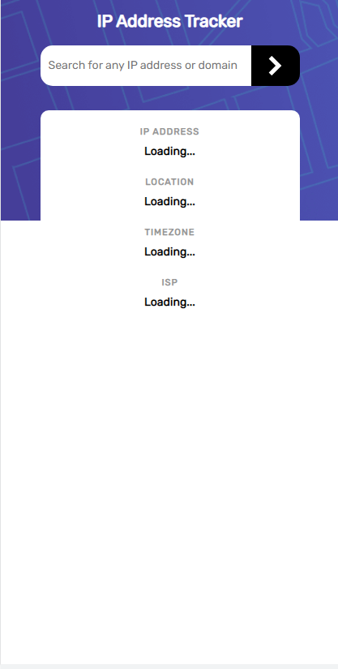
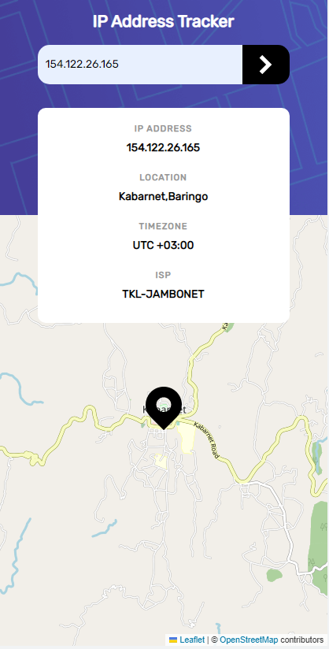

# Frontend Mentor - IP address tracker solution

This is a solution to the [IP address tracker challenge on Frontend Mentor](https://www.frontendmentor.io/challenges/ip-address-tracker-I8-0yYAH0). Frontend Mentor challenges help you improve your coding skills by building realistic projects. 

## Table of contents

- [Overview](#overview)
  - [The challenge](#the-challenge)
  - [Screenshot](#screenshot)
  - [Links](#links)
- [My process](#my-process)
  - [Built with](#built-with)
  - [Useful resources](#useful-resources)
- [Author](#author)

## Overview

### The challenge

Users should be able to:

- View the optimal layout for each page depending on their device's screen size
- See hover states for all interactive elements on the page
- See their own IP address on the map on the initial page load
- Search for any IP addresses or domains and see the key information and location
- My solution can handle invalid ip address or domain name

### Screenshot
### Dektop View

### Mobile View

### Links

- Solution URL: 
- Live Site URL: [live site URL here](https://aymenfisher.github.io/ip-address-tracker)

## My process

### Built with

- Semantic HTML5 markup
- CSS custom properties
- Flexbox
- CSS Grid
- Mobile-first workflow
- async / await
- fetch API
- some Regex patterns
- leaflet JS
- ipify API

### Useful resources

- [URL regex](https://stackoverflow.com/questions/3809401/what-is-a-good-regular-expression-to-match-a-url)
- [IP address regex](https://melvingeorge.me/blog/check-if-string-is-valid-ip-address-javascript)

## Author

- Github - [Aymen boudabia](https://github.com/Aymenfisher)
- Frontend Mentor - [@aymenfisher](https://www.frontendmentor.io/profile/Aymenfisher)

